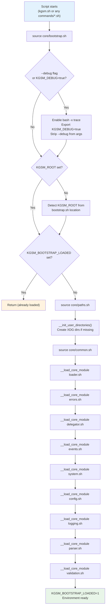
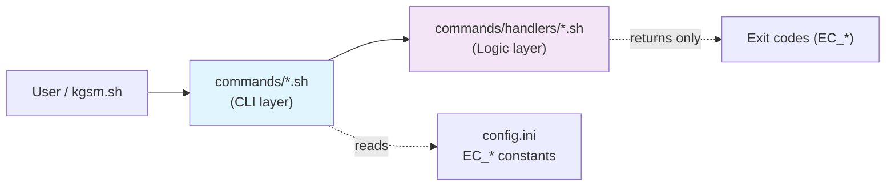
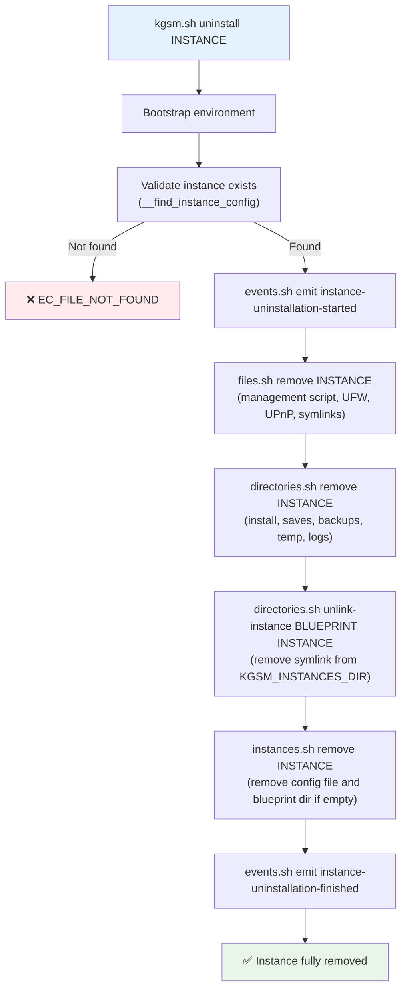
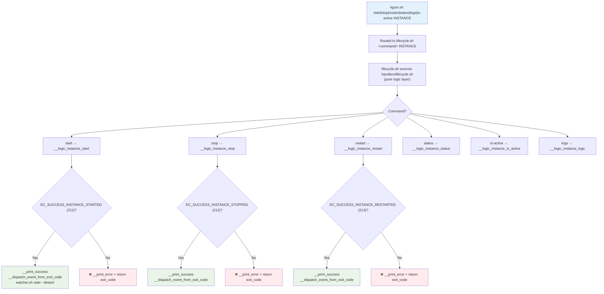
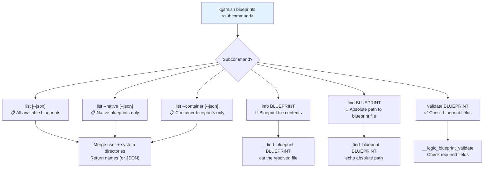
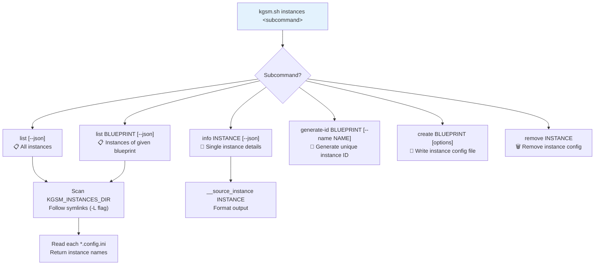
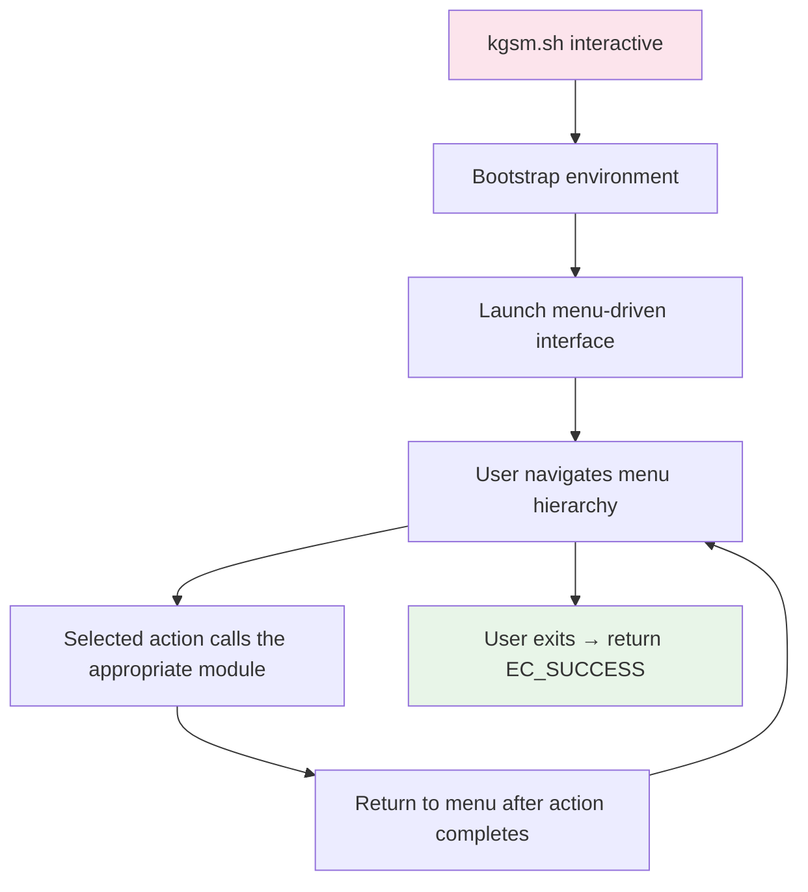

# KGSM Execution Flows

This document explains KGSM's internal execution flows—how the system initialises, how commands are routed, and what happens at each stage when a user runs a command. It is aimed at developers and advanced users who want to understand KGSM's architecture and runtime behaviour.

---

## Bootstrap and Initialisation Flow

Every KGSM script—including `kgsm.sh` itself—begins by sourcing `core/bootstrap.sh`. This single entry point establishes the entire execution environment before any command logic runs.


```mermaid
graph TD
    A["Script starts<br/>(kgsm.sh or any commands/*.sh)"] --> B["source core/bootstrap.sh"]

    B --> B0{"--debug flag<br/>or KGSM_DEBUG=true?"}
    B0 -->|"Yes"| B0a["Enable bash -x trace<br/>Export KGSM_DEBUG=true<br/>Strip --debug from args"]
    B0 -->|"No"| B1
    B0a --> B1

    B1{"KGSM_ROOT set?"} -->|"No"| B2["Detect KGSM_ROOT from<br/>bootstrap.sh location"]
    B1 -->|"Yes"| B3
    B2 --> B3

    B3{"KGSM_BOOTSTRAP_LOADED set?"} -->|"Yes"| B_DONE["Return (already loaded)"]
    B3 -->|"No"| B4

    B4["source core/paths.sh"] --> B5["__init_user_directories()<br/>Create XDG dirs if missing"]
    B5 --> B6["source core/common.sh"]

    B6 --> C1["__load_core_module loader.sh"]
    C1 --> C2["__load_core_module errors.sh"]
    C2 --> C3["__load_core_module delegator.sh"]
    C3 --> C4["__load_core_module events.sh"]
    C4 --> C5["__load_core_module system.sh"]
    C5 --> C6["__load_core_module config.sh"]
    C6 --> C7["__load_core_module logging.sh"]
    C7 --> C8["__load_core_module parser.sh"]
    C8 --> C9["__load_core_module validation.sh"]

    C9 --> D["KGSM_BOOTSTRAP_LOADED=1<br/>Environment ready"]

    style A fill:#e3f2fd
    style D fill:#e8f5e8
    style B_DONE fill:#fff3e0
```

### What Each Step Establishes

| Module | Purpose |
|--------|---------|
| `core/paths.sh` | Defines all path constants (`KGSM_ROOT`, `KGSM_CORE_DIR`, `KGSM_COMMANDS_DIR`, `KGSM_HANDLERS_DIR`, user XDG paths, etc.) |
| `core/loader.sh` | File-discovery functions (`__find_or_fail`, `__find_command`, `__find_core_module`, `__find_blueprint`, `__source_instance`, etc.) |
| `core/errors.sh` | All `EC_*` exit code constants (0–255 range, including success-event codes 200+) |
| `core/delegator.sh` | Generates bash wrapper functions for every `commands/*.sh` file so modules can call each other by name (e.g. `instances.sh`, `directories.sh`) |
| `core/events.sh` | Event dispatch helpers (`events.sh emit …`) |
| `core/system.sh` | Host system utilities |
| `core/config.sh` | Reads and exports `config_*` variables from `config.ini` |
| `core/logging.sh` | `__print_info`, `__print_error`, `__print_success`, `__print_warning`, `__print_debug` |
| `core/parser.sh` | Blueprint and INI parsing helpers |
| `core/validation.sh` | Input-validation functions |

### Guard Variables

Each module sets a guard variable on first load and returns immediately if the variable is already set, preventing double-sourcing:

| Module | Guard variable |
|--------|---------------|
| `bootstrap.sh` | `KGSM_BOOTSTRAP_LOADED` |
| `loader.sh` | `KGSM_LOADER_LOADED` |
| `errors.sh` | `KGSM_ERRORS_LOADED` |
| `delegator.sh` | `KGSM_DELEGATOR_LOADED` |
| `common.sh` | `KGSM_COMMON_LOADED` |

### XDG Directory Layout

KGSM follows the [XDG Base Directory Specification](https://specifications.freedesktop.org/basedir-spec/latest/). User-writable paths are separated from the read-only installation tree:

```
System (read-only, under KGSM_ROOT)          User (writable, under XDG dirs)
────────────────────────────────────         ──────────────────────────────────────────
core/                                        ~/.config/kgsm/config.ini
commands/                                    ~/.local/share/kgsm/instances/
commands/handlers/                           ~/.local/share/kgsm/logs/
templates/                                   ~/.local/share/kgsm/blueprints/
migrations/                                  ~/.local/share/kgsm/overrides/
blueprints/  (default *.bp.yaml blueprints)
overrides/   (system overrides)
config.default.ini
```

Run `kgsm.sh --paths` to see the resolved values for the current environment.

---

## Command Routing (kgsm.sh)

After bootstrap completes, `kgsm.sh` reads the first positional argument and routes to the appropriate handler.


```mermaid
graph TD
    A["kgsm.sh &lt;command&gt; [args]"] --> B{First argument?}

    B --> META["Built-in meta commands"]
    B --> MOD["Module passthroughs"]
    B --> LIFE["Lifecycle shortcuts"]
    B --> UNK["Unknown → EC_INVALID_ARG"]

    META --> M1["-h / --help / help<br/>→ show_usage()"]
    META --> M2["-v / --version<br/>→ _cmd_version()"]
    META --> M3["--paths<br/>→ _cmd_paths()"]

    MOD --> P1["install / create → install.sh"]
    MOD --> P2["uninstall / remove → uninstall.sh"]
    MOD --> P3["interactive → interactive.sh"]
    MOD --> P4["blueprints → blueprints.sh"]
    MOD --> P5["config → config.sh"]
    MOD --> P6["directories → directories.sh"]
    MOD --> P7["events → events.sh"]
    MOD --> P8["files → files.sh"]
    MOD --> P9["instances → instances.sh"]
    MOD --> P10["lifecycle → lifecycle.sh"]
    MOD --> P11["network → network.sh"]
    MOD --> P12["system → system.sh"]
    MOD --> P13["watcher → watcher.sh"]

    LIFE --> L1["start → lifecycle.sh start"]
    LIFE --> L2["stop → lifecycle.sh stop"]
    LIFE --> L3["restart → lifecycle.sh restart"]
    LIFE --> L4["status → lifecycle.sh status"]
    LIFE --> L5["logs → lifecycle.sh logs"]
    LIFE --> L6["is-active → lifecycle.sh is-active"]

    style A fill:#e3f2fd
    style UNK fill:#ffebee
```

Module passthroughs execute the target script directly (e.g., `install.sh "$@"`). Each target script re-runs the full bootstrap sequence, which is a no-op because the guard variables are already set in the calling process. This is done on purpose, because all target scripts can also be called directly to only run specific functions without going through `kgsm.sh`, so each script has to be able to set up the environment.

---

## Module Architecture: Command / Handler Pattern

Command scripts in `commands/` are divided into two layers:


```mermaid
graph LR
    CLI["User / kgsm.sh"] --> CMD["commands/*.sh<br/>(CLI layer)"]
    CMD --> HND["commands/handlers/*.sh<br/>(Logic layer)"]

    CMD -. "reads" .-> CFG["config.ini<br/>EC_* constants"]
    HND -. "returns only" .-> EC["Exit codes (EC_*)"]

    style CMD fill:#e1f5fe
    style HND fill:#f3e5f5
```

**Command scripts** (`commands/lifecycle.sh`, `commands/blueprints.sh`, etc.):
- Parse CLI arguments
- Print user-facing messages (`__print_info`, `__print_error`, `__print_success`)
- Call the corresponding `__logic_*` function from the handler
- Dispatch events via `events.sh emit …` based on the returned exit code
- Translate success-event exit codes (200+) into `EC_SUCCESS` (0) for the shell

**Handler scripts** (`commands/handlers/lifecycle.sh`, etc.):
- Contain pure business logic with **no I/O**
- Communicate results exclusively through exit codes
- Are sourced by the command script at startup via `__find_command_handler`

Example from `commands/lifecycle.sh`:

```bash
# Source the handler
source "$(__find_command_handler lifecycle.sh)"

function _cmd_start() {
  # … argument parsing …
  __logic_instance_start "$instance_name"   # pure logic, no output
  exit_code=$?
  case $exit_code in
    $EC_SUCCESS_INSTANCE_STARTED)           # 211
      __print_success "Instance started"
      __dispatch_event_from_exit_code "$exit_code" "$instance_name"
      return $EC_SUCCESS
      ;;
    *) __print_error "Failed to start"; return $exit_code ;;
  esac
}
```

---

## Delegator: Dynamic Module Wrappers

`core/delegator.sh` is loaded by `core/common.sh` at bootstrap time. It scans every `*.sh` file in `commands/` (one level deep) and generates a bash function with the same name for each one:

```bash
# Generated dynamically by delegator.sh for, e.g., instances.sh
function instances.sh() {
  "$(__find_command instances.sh)" "$@"
}
export -f instances.sh
```

This means any script that has sourced bootstrap can call `instances.sh generate-id factorio` or `directories.sh create "$instance"` as if they were built-in commands, without knowing their absolute paths. The `__find_command` function resolves them at call-time, searching only the top level of `$KGSM_COMMANDS_DIR` (never the `handlers/` subdirectory).

---

## 1. Instance Creation Flow

**Command:** `kgsm.sh install BLUEPRINT [--install-dir DIR] [--version VER] [--name NAME]`  
**Aliases:** `kgsm.sh create BLUEPRINT …`  
**Handled by:** `commands/install.sh`


```mermaid
graph TD
    A["kgsm.sh install BLUEPRINT [options]"] --> AA["Bootstrap environment"]
    AA --> B["Parse arguments<br/>(blueprint, install-dir, version, name)"]
    B --> C{"install-dir<br/>provided?"}
    C -->|"No"| C1["Use config_default_install_directory"]
    C -->|"Yes"| D
    C1 --> D

    D["directories.sh ensure-created install_dir"] --> E["instances.sh generate-id BLUEPRINT [--name NAME]<br/>→ unique instance identifier"]
    E --> F["directories.sh ensure-created working_dir<br/>(install_dir/BLUEPRINT/INSTANCE)"]
    F --> G["directories.sh link-instance BLUEPRINT INSTANCE working_dir<br/>(symlink in KGSM_INSTANCES_DIR)"]
    G --> H["instances.sh create BLUEPRINT --install-dir --name<br/>→ writes INSTANCE.config.ini"]
    H --> EVT1["events.sh emit instance-installation-started"]

    EVT1 --> I["directories.sh create INSTANCE<br/>(install, saves, backups, temp, logs)"]
    I --> J["files.sh create INSTANCE<br/>(assemble management script from modules,<br/>config files, integrations)"]
    J --> K["__source_instance INSTANCE<br/>(load instance_* variables)"]

    K --> L{"version == 0<br/>(latest)?"}
    L -->|"Yes"| L1["instance_management_file --version --latest"]
    L -->|"No"| M
    L1 --> M

    M["events.sh emit instance-download-started"] --> N["instance_management_file --download VERSION"]
    N -->|"Success"| O["events.sh emit instance-download-finished"]
    N -->|"Failure"| Z1["❌ EC_FAILED_DOWNLOAD<br/>events.sh emit instance-download-failed"]

    O --> P["events.sh emit instance-deploy-started"]
    P --> Q["instance_management_file --deploy"]
    Q -->|"Success"| R["events.sh emit instance-deploy-finished"]
    Q -->|"Failure"| Z2["❌ EC_FAILED_DEPLOY<br/>events.sh emit instance-deploy-failed"]

    R --> S["instance_management_file --version --save VERSION"]
    S --> T["events.sh emit instance-installation-finished"]
    T --> U["✅ __print_success<br/>events.sh emit instance-installed"]

    style A fill:#e3f2fd
    style U fill:#e8f5e8
    style Z1 fill:#ffebee
    style Z2 fill:#ffebee
```

### What Happens:
1. **Directory bootstrap**: The target `install_dir` is created or validated, then a per-instance subdirectory (`install_dir/BLUEPRINT/INSTANCE`) is created and symlinked into `KGSM_INSTANCES_DIR`.
2. **Instance config**: `instances.sh create` writes `INSTANCE.config.ini` through the symlink into the working directory.
3. **Directory structure**: `directories.sh create` creates the full runtime directory set (install, saves, backups, temp, logs).
4. **Management script assembly**: `files.sh create` assembles the management script by concatenating numbered modules from `templates/manage.{runtime}.d/`, substituting per-game override modules from `overrides/{blueprint_name}/` for modules 03–11 where they exist. The assembled script, plus optional UFW rules and UPnP configuration, are written to the instance directory.
5. **Download**: The generated management script is called with `--download` to fetch game files via the override's `_download()` function.
6. **Deploy**: `--deploy` moves files from the temp directory to the install directory via `_deploy()`.
7. **Version record**: The resolved version string is persisted to the instance config.
8. **Events**: Named events are emitted at each stage (`instance-installation-started`, `instance-downloaded`, `instance-installed`, etc.) for webhook or socket consumers.

---

## 2. Instance Removal Flow

**Command:** `kgsm.sh uninstall INSTANCE`  
**Aliases:** `kgsm.sh remove INSTANCE`  
**Handled by:** `commands/uninstall.sh`


```mermaid
graph TD
    A["kgsm.sh uninstall INSTANCE"] --> AA["Bootstrap environment"]
    AA --> B["Validate instance exists<br/>(__find_instance_config)"]
    B -->|"Not found"| Z1["❌ EC_FILE_NOT_FOUND"]
    B -->|"Found"| C["events.sh emit instance-uninstallation-started"]

    C --> D["files.sh remove INSTANCE<br/>(management script, UFW, UPnP, symlinks)"]
    D --> E["directories.sh remove INSTANCE<br/>(install, saves, backups, temp, logs)"]
    E --> F["directories.sh unlink-instance BLUEPRINT INSTANCE<br/>(remove symlink from KGSM_INSTANCES_DIR)"]
    F --> G["instances.sh remove INSTANCE<br/>(remove config file and blueprint dir if empty)"]
    G --> H["events.sh emit instance-uninstallation-finished"]
    H --> I["✅ Instance fully removed"]

    style A fill:#e3f2fd
    style I fill:#e8f5e8
    style Z1 fill:#ffebee
```

### What Happens:
1. **Validation**: The instance config file is located via `__find_instance_config`; the command fails immediately if it is not found.
2. **File removal**: All generated files (management script, optional UFW/UPnP/symlink integrations) are removed by `files.sh remove`.
3. **Directory removal**: All runtime directories are removed by `directories.sh remove`.
4. **Symlink cleanup**: The symlink in `KGSM_INSTANCES_DIR` is removed by `directories.sh unlink-instance`.
5. **Config removal**: The config file and, if now empty, the blueprint subdirectory under `KGSM_INSTANCES_DIR`, are removed by `instances.sh remove`.

This is an irreversible, destructive operation. All game data is permanently deleted.

---

## 3. Lifecycle Operations Flow

**Direct commands (shortcuts):**
```
kgsm.sh start    INSTANCE
kgsm.sh stop     INSTANCE
kgsm.sh restart  INSTANCE
kgsm.sh status   INSTANCE [--json] [--fast]
kgsm.sh logs     INSTANCE [-f|--follow] [--tail N]
kgsm.sh is-active INSTANCE
```

**Module form:** `kgsm.sh lifecycle <command> INSTANCE [options]`  
**Handled by:** `commands/lifecycle.sh` (CLI) + `commands/handlers/lifecycle.sh` (logic)


```mermaid
graph TD
    A["kgsm.sh start|stop|restart|status|logs|is-active INSTANCE"] --> B["Routed to lifecycle.sh &lt;command&gt; INSTANCE"]
    B --> C["lifecycle.sh sources handlers/lifecycle.sh<br/>(pure logic layer)"]

    C --> D{Command?}

    D --> S["start → __logic_instance_start"]
    D --> T["stop → __logic_instance_stop"]
    D --> R["restart → __logic_instance_restart"]
    D --> ST["status → __logic_instance_status"]
    D --> IA["is-active → __logic_instance_is_active"]
    D --> L["logs → __logic_instance_logs"]

    S --> S1{"EC_SUCCESS_INSTANCE_STARTED (211)?"}
    S1 -->|"Yes"| S2["__print_success<br/>__dispatch_event_from_exit_code<br/>watcher.sh start --detach"]
    S1 -->|"No"| SE["❌ __print_error + return exit_code"]

    T --> T1{"EC_SUCCESS_INSTANCE_STOPPED (212)?"}
    T1 -->|"Yes"| T2["__print_success<br/>__dispatch_event_from_exit_code"]
    T1 -->|"No"| TE["❌ __print_error + return exit_code"]

    R --> R1{"EC_SUCCESS_INSTANCE_RESTARTED (213)?"}
    R1 -->|"Yes"| R2["__print_success<br/>__dispatch_event_from_exit_code"]
    R1 -->|"No"| RE["❌ __print_error + return exit_code"]

    style A fill:#e3f2fd
    style S2 fill:#e8f5e8
    style T2 fill:#e8f5e8
    style R2 fill:#e8f5e8
    style SE fill:#ffebee
    style TE fill:#ffebee
    style RE fill:#ffebee
```

### Command/Handler Interaction

The handler (`__logic_instance_start`, etc.) returns one of the success-event exit codes (211–213) on success, or a standard `EC_*` error code on failure. The command layer translates:

- **Success-event codes (200+)**: print success message, dispatch event, return `EC_SUCCESS` (0) to the caller.
- **Error codes**: print error message, propagate the exit code unchanged.

After a successful `start`, the lifecycle command also launches `watcher.sh start --detach` in the background (best-effort; failure is silently ignored) to monitor the instance for readiness.

---

## 4. Blueprint Management Flow

**Command:** `kgsm.sh blueprints <subcommand> [options]`  
**Handled by:** `commands/blueprints.sh` + `commands/handlers/blueprints.sh`

Blueprint resolution follows a priority order defined in `core/loader.sh`:

```
1. User custom native blueprint    ($KGSM_USER_BLUEPRINTS_NATIVE_DIR)
2. User custom container blueprint ($KGSM_USER_BLUEPRINTS_CONTAINER_DIR)
3. Default native blueprint        ($KGSM_SYSTEM_BLUEPRINTS_NATIVE_DIR)
4. Default container blueprint     ($KGSM_SYSTEM_BLUEPRINTS_CONTAINER_DIR)
```

This order is implemented in `__find_blueprint()` (in `core/loader.sh`) and applies to every blueprint lookup across the system.


```mermaid
graph TD
    A["kgsm.sh blueprints &lt;subcommand&gt;"] --> B{Subcommand?}

    B --> C["list [--json]<br/>📋 All available blueprints"]
    B --> D["list --native [--json]<br/>📋 Native blueprints only"]
    B --> E["list --container [--json]<br/>📋 Container blueprints only"]
    B --> F["info BLUEPRINT<br/>📄 Blueprint file contents"]
    B --> G["find BLUEPRINT<br/>📍 Absolute path to blueprint file"]
    B --> H["validate BLUEPRINT<br/>✅ Check blueprint fields"]

    C & D & E --> J["Merge user + system directories<br/>Return names (or JSON)"]
    F --> K["__find_blueprint BLUEPRINT<br/>cat the resolved file"]
    G --> L["__find_blueprint BLUEPRINT<br/>echo absolute path"]
    H --> M["__logic_blueprint_validate<br/>Check required fields"]

    style A fill:#e3f2fd
```

---

## 5. Instance Listing Flow

**Command:** `kgsm.sh instances <subcommand> [options]`  
**Handled by:** `commands/instances.sh` + `commands/handlers/instances.sh`


```mermaid
graph TD
    A["kgsm.sh instances &lt;subcommand&gt;"] --> B{Subcommand?}

    B --> C["list [--json]<br/>📋 All instances"]
    B --> D["list BLUEPRINT [--json]<br/>📋 Instances of given blueprint"]
    B --> E["info INSTANCE [--json]<br/>📄 Single instance details"]
    B --> F["generate-id BLUEPRINT [--name NAME]<br/>🔑 Generate unique instance ID"]
    B --> G["create BLUEPRINT [options]<br/>📝 Write instance config file"]
    B --> H["remove INSTANCE<br/>🗑️ Remove instance config"]

    C & D --> I["Scan KGSM_INSTANCES_DIR<br/>Follow symlinks (-L flag)"]
    I --> J["Read each *.config.ini<br/>Return instance names"]
    E --> K["__source_instance INSTANCE<br/>Format output"]

    style A fill:#e3f2fd
```

---

## 6. Interactive Mode

**Command:** `kgsm.sh interactive`  
**Handled by:** `commands/interactive.sh`


```mermaid
graph TD
    A["kgsm.sh interactive"] --> B["Bootstrap environment"]
    B --> C["Launch menu-driven interface"]
    C --> D["User navigates menu hierarchy"]
    D --> E["Selected action calls the appropriate module"]
    E --> F["Return to menu after action completes"]
    F --> D
    D --> G["User exits → return EC_SUCCESS"]

    style A fill:#fce4ec
    style G fill:#e8f5e8
```

The interactive mode is implemented as a guided menu system that wraps the same commands available via the CLI. It does not have additional capabilities; it makes them accessible without memorising command syntax.

---

## 7. Built-in Meta Commands

These commands are handled entirely within `kgsm.sh` without delegating to a module:

| Command | Function | Description |
|---------|----------|-------------|
| `-h`, `--help`, `help` | `show_usage()` | Display full usage information |
| `-v`, `--version` | `_cmd_version()` | Print KGSM version and licence |
| `--paths` | `_cmd_paths()` | Print all resolved XDG path constants |

---

## Error Handling and Exit Codes

KGSM uses a unified exit-code system defined in `core/errors.sh`. All constants are read-only (`declare -g -r`) and exported.

### Error Codes (0–46)

| Code | Constant | Meaning |
|------|----------|---------|
| 0 | `EC_SUCCESS` | Operation successful |
| 1 | `EC_ERROR` | General error |
| 5 | `EC_FILE_NOT_FOUND` | File or config not found |
| 7 | `EC_MISSING_ARG` | Required argument missing |
| 8 | `EC_INVALID_ARG` | Argument invalid or unrecognised |
| 13 | `EC_FAILED_DOWNLOAD` | Game file download failed |
| 14 | `EC_FAILED_DEPLOY` | Game file deployment failed |
| 27 | `EC_BLUEPRINT_NOT_FOUND` | Blueprint file not found |
| 29 | `EC_INVALID_INSTANCE` | Instance config invalid |

### Success-Event Codes (200–255)

These codes are returned by handler functions to signal that a specific event should be dispatched. The command layer converts them to `EC_SUCCESS` (0) after dispatching the event.

| Code | Constant | Triggered Event |
|------|----------|----------------|
| 210 | `EC_SUCCESS_INSTANCE_CREATED` | `instance-created` |
| 211 | `EC_SUCCESS_INSTANCE_STARTED` | `instance-started` |
| 212 | `EC_SUCCESS_INSTANCE_STOPPED` | `instance-stopped` |
| 213 | `EC_SUCCESS_INSTANCE_RESTARTED` | `instance-restarted` |
| 214 | `EC_SUCCESS_INSTANCE_REMOVED` | `instance-removed` |
| 220 | `EC_SUCCESS_DEPLOYMENT_STARTED` | `instance-deploy-started` |
| 221 | `EC_SUCCESS_DEPLOYMENT_FINISHED` | `instance-deploy-finished` |

---

## Command Summary by User Intent

| User Goal | Command | Handled by |
|-----------|---------|-----------|
| Install a game server | `kgsm.sh install BLUEPRINT` | `commands/install.sh` |
| Remove a game server | `kgsm.sh uninstall INSTANCE` | `commands/uninstall.sh` |
| Start a server | `kgsm.sh start INSTANCE` | `commands/lifecycle.sh` |
| Stop a server | `kgsm.sh stop INSTANCE` | `commands/lifecycle.sh` |
| Restart a server | `kgsm.sh restart INSTANCE` | `commands/lifecycle.sh` |
| View server status | `kgsm.sh status INSTANCE` | `commands/lifecycle.sh` |
| View logs | `kgsm.sh logs INSTANCE [--follow]` | `commands/lifecycle.sh` |
| Check if running | `kgsm.sh is-active INSTANCE` | `commands/lifecycle.sh` |
| List blueprints | `kgsm.sh blueprints list` | `commands/blueprints.sh` |
| List instances | `kgsm.sh instances list` | `commands/instances.sh` |
| Manage configuration | `kgsm.sh config <subcommand>` | `commands/config.sh` |
| Manage network/ports | `kgsm.sh network <subcommand>` | `commands/network.sh` |
| Manage events | `kgsm.sh events <subcommand>` | `commands/events.sh` |
| Monitor instances | `kgsm.sh watcher <subcommand>` | `commands/watcher.sh` |
| Use a menu interface | `kgsm.sh interactive` | `commands/interactive.sh` |
| Show version | `kgsm.sh --version` | `kgsm.sh` (built-in) |
| Show paths | `kgsm.sh --paths` | `kgsm.sh` (built-in) |

---

## Integration Points

KGSM integrates with external systems through dedicated sub-commands and optional configuration:

- **UFW**: Firewall rule management (`files.ufw.sh`, enabled via `config_enable_firewall_management`)
- **UPnP**: Port forwarding (`files.upnp.sh`, enabled via `config_enable_port_forwarding`)
- **Steam**: Game file downloading via SteamCMD (implemented in override `_download()` functions)
- **Docker**: Container-based servers declare `runtime: container` and embed their Docker Compose under `container.compose` in the unified `.bp.yaml` blueprint
- **Webhooks / Unix sockets**: Event delivery via `commands/events.webhook.sh` and `commands/events.socket.sh`
